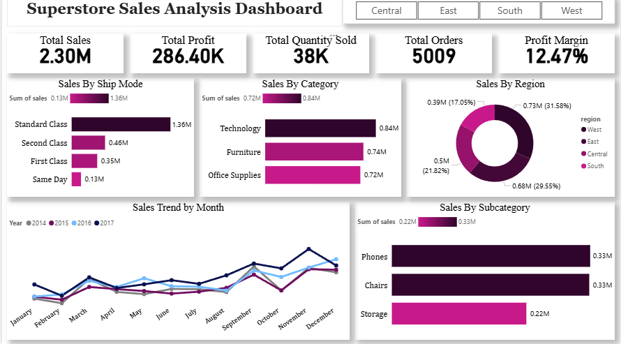
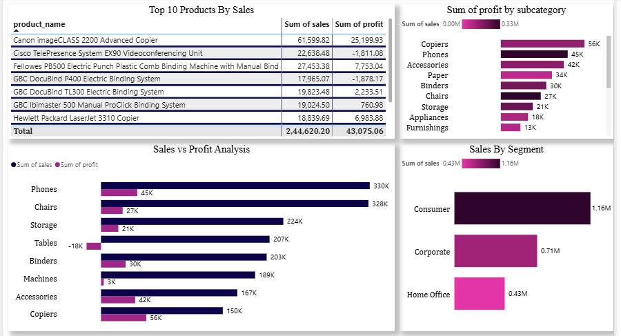

# Superstore Sales Analysis

## 📊 Project Overview
This project analyzes sales performance of a retail superstore dataset to identify key insights related to sales, profit, and regional performance.

## Objective
To analyze sales performance and identify key insights to improve business profitability and decison-making

## 🛠️ Tools Used
- Python (Pandas, NumPy) → Data Cleaning
- Power BI → Dashboard & Visualization

## 🧹 Data Cleaning Steps
- Handled missing values
- Removed duplicates
- Corrected data types
- Converted date columns

## 📈 Dashboard Features
- Sales & Profit KPIs
- Sales by Category & Sub-Category
- Regional Analysis
- Time-based Trends (Year & Month)
- Interactive Filters (Region, Category)

## 🧠 Key Insights
- Technology category generated the highest sales
- Some sub-categories are consistently making losses
- High discounts negatively impact profit
- West region performs best overall
- Certain products have high sales but low profit

## 🖼️ Dashboard Preview

### Page 1

### Page 2

## 📂 Project Structure
- cleaned_superstore.csv
- Sample - Superstore.csv
- Superstore_Sales_Data_Analysis.ipynb
- dashboard_page1.png
- dashboard_page2.png
